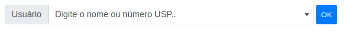

# Senhaunica-socialite

## Componentes

### <x-senhaunica::select-pessoa />

Cria um campo tipo select com o plugin select2 para fazer a busca por número USP ou por nome fonético na base replicada.

Para usar esse componente coloque no seu código 

    <x-senhaunica::select-pessoa />

ou com os atributos opcionais

    <x-senhaunica::select-pessoa prepend="opcional" append="opcional" label="opcional" groupClass="opcional" class="opcional"/>

ou usando slots

    <x-senhaunica::select-pessoa>
    ... slot ...
    </x-senhaunica::select-pessoa>

Esse componente criará um form-group do bootstrap. Veja mais na [documentação do boostrap](https://getbootstrap.com/docs/4.6/components/forms/#form-controls).

* o select criado possuirá o atributo `name="codpes"`
* o componente deverá estar dentro de um `form`
* o atributo `groupClass` será aplicado no `form-group` pai do componente
* o atributo `class` será aplicado no `select`
* atributos adicionais serão colocados no `select`

No `config/senhaunica.php`, você deve ajustar a variável `findUsersGate`, colocando o gate autorizado para esse método do controller. O padrão é `admin`.

#### Exemplo

Vamos colocar um botão de submit logo após o campo select.

    <x-senhaunica::select-pessoa prepend="Usuário">
       <input type="submit" class="btn btn-sm btn-primary ml-1" value="OK">
    </x-senhaunica::select-pessoa>

gerará o seguinte html:

    

        

            

                
Usuário

            

            <select id="select-1220437" name="codpes" class="form-control " autocomplete="off">
                <option>Digite o nome ou número USP..</option>
            </select>
            <input type="submit" class="btn btn-sm btn-primary ml-1" value="OK">
        

    

E renderizado ficará

