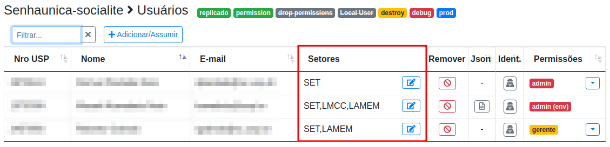

# Senhaunica-socialite

## Campo de usuário personalizado

Se você tiver um campo a mais na tabela `users` e quiser modificar ele, o campo de usuário personalizado permite mostrar e editar a coluna na lista de usuários padrão da biblioteca.



### Como utilizar

Tecnicamente, essa configuração adicionará uma coluna na lista de usuários e permite inserir nessa coluna uma view personalizada (view). É possivel também ajustar o título da coluna (label) e fixar sua largura (width).

Esse recurso está disponível à partir da **versão 4.2**.

Para utilizar você deve editar seu arquivo `config/senhaunica.php` e incluir as linhas abaixo. No arquivo original da biblioteca ela começa na linha 29 do arquivo (para o caso de você ter TOC e quiser manter a formatação original :) 

```php
// view para editar campo de usuário personalizado
// é passado $user para a view
'customUserField' => ['view'=>'user.setores', 'label'=>'Setores', 'width'=>'200px'],
```

Nesse caso vamos mostrar um exemplo de uso para uma coluna chamada `setores`, tipo `string`, da tabela `users`. Se você ainda não criou a migration correspondente à criação dessa coluna faça-o agora. 

O campo personalizado consiste em uma view com form de edição, uma rota e um controller. A view é `user.setores`, na lista de usuários, o nome da coluna é `Setores` e a sua largura é de `200px`. 

Como estamos editando o model **User** vamos criar uma rota tipo resource para facilitar. Edite o arquivo `routes/web.php` e adicione a linha:
```php
Route::resource('/user', UserController::class);
```

Se você ainda não possui o UserController vamos criá-lo:

```bash
php artisan create:UserController --resource
```

Vamos editar o método `update` para receber os dados do form. O arquivo é `app/Http/Controllers/UserController.php`.

```php
public function update(Request $request, $id)
{
    $this->authorize('admin');

    $request->validate([
        'setores' => 'nullable|string',
    ]);

    $user = User::find($id);
    $user->setores = $request->setores;
    $user->save();
    return back();
}
```

Vamos criar o arquivo da view indicada no arquivo de configuração que é `resources/views/user/setores.blade.php`. Vamos mostrar o conteúdo do campo `$user->setores` e um botão para abrir o form de editar. O form está em um modal que é comum a todos os registros. Para popular os dados, vamos passar por atributo data-X do html.

```html
<div class="d-inline">{{ $user->setores }}</div>
<button class="btn py-0 btn-sm btn-outline-primary d-inline float-right" data-toggle="modal"
  data-target="#userSetorModal" data-setores="{{ $user->setores }}" data-action="user/{{ $user->id }}">
  <i class="fas fa-edit"></i>
</button>

@once
  @section('bottom_senhaunica_users')
    @parent
    <div class="modal fade" id="userSetorModal" tabindex="-1" aria-labelledby="userSetorModalLabel" aria-hidden="true">
      <div class="modal-dialog">
        <div class="modal-content">
          <form method="POST" action="">
            @csrf
            @method('put')
            <div class="modal-header">
              <h5 class="modal-title" id="userSetorModalLabel">Setores</h5>
              <button type="button" class="close" data-dismiss="modal" aria-label="Close">
                <span aria-hidden="true">&times;</span>
              </button>
            </div>
            <div class="modal-body">
              <x-input-text name="setores"></x-input-text>
            </div>
            <div class="modal-footer">
              <button type="button" class="btn btn-secondary" data-dismiss="modal">Cancelar</button>
              <button type="submit" class="btn btn-primary">Salvar</button>
            </div>
          </form>
        </div>
      </div>
    </div>
  @endsection

  @section('javascripts_bottom')
    @parent
    <script>
      $(document).ready(function() {
        $('#userSetorModal').on('show.bs.modal', function(event) {
          var button = $(event.relatedTarget) // Button that triggered the modal
          $(this).find('input[name=setores]').val(button.data('setores'))
          $(this).find('form').attr('action', button.data('action'))
        })

        $('#userSetorModal').on('shown.bs.modal', function(event) {
          console.log('shown')
          $(this).find('input[name=setores]').trigger('focus')
        })
      })
    </script>
  @endsection
@endonce
```

Veja que tanto o modal quanto o javascript estão dentro da tag @once permitindo que sejam incluídos em todas as linhas da lista de usuários mas apareçam apenas uma vez no html final.

Voltar para  [README.md](./README.md).